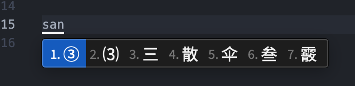
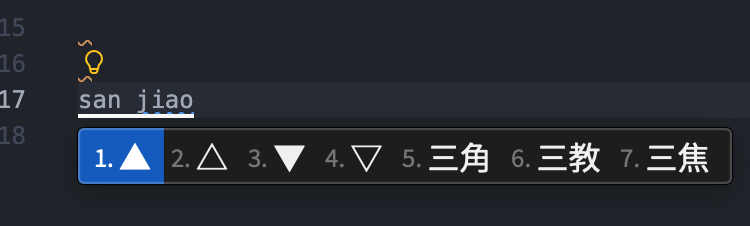
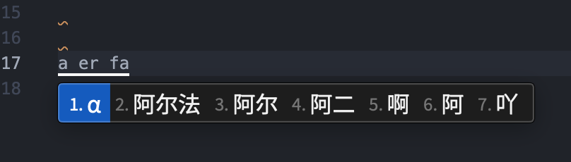
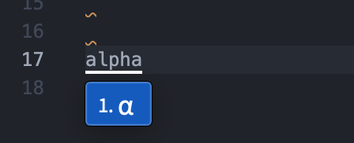
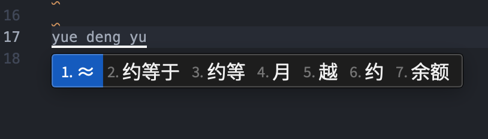
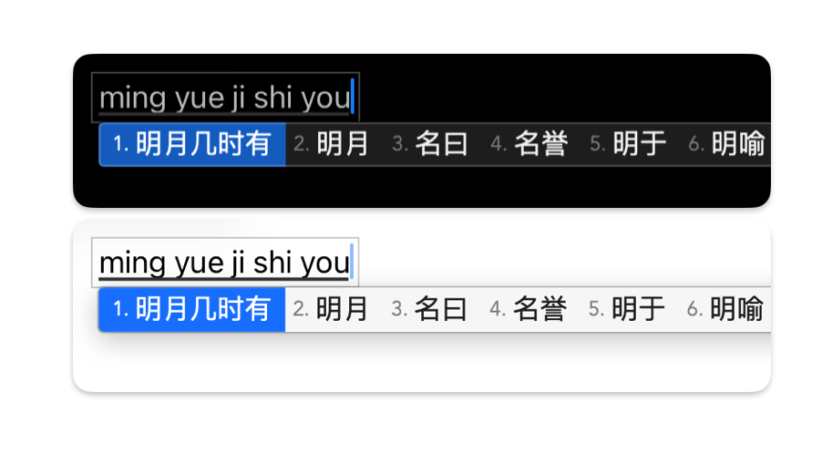

# 适用于鼠须管及明月拼音的自定义配置

提供个人使用的鼠须管及明月拼音设置。

## 预设一览

### 添加符号的扩展词典

自定义符号扩展词典可直接输入多种符号：

|                               |                         |
|:-----------------------------:|:-----------------------:|
|             |  |
|        ||
||                        |

详情请参阅[Rime/custom_char.dict.yaml](Rime/custom_char.dict.yaml)。

### 添加`slim-native`主题

Slim Native主题是本配置的原创主题，接近系统原生的设计，并舍去多余元素，力求简洁、明快。



> [!TIPS]
>
> 您可以安装思源雅黑，以获得更全面的字符支持。
>
> 关于如何使用思源雅黑，参见[Rime/squirrel.custom.yaml](Rime/squirrel.custom.yaml)。

### 符合多数输入法的标点输入

对常见的标点优化默认输入，禁用字符选窗。

> [!IMPORTANT]
>
> 默认启用了笔画输入，这会在输入`时启动。
>
> 若要关闭，请参见[Rime/luna_pinyin.custom.yaml](Rime/luna_pinyin.custom.yaml)。

## 安装

> [!TIPS]
>
> 一句话总结：将`Rime`下的文件复制或合并到`~/Library/Rime`下即可。

1. 需要安装[鼠须管](https://rime.im/download/)并启用“明月拼音”。
    1. 安装后，如果没有该输入法需要在
       “系统设置 > 键盘 > 文字输入 > 输入法 > 编辑”中添加该输入法。
    2. 按下Control + `，选择朙月拼音。任何版本的明月拼音都受到支持。
1. 将`Rime`下的文件复制或合并到`~/Library/Rime`下，

> [!IMPORTANT]
>
> `~/Library/Rime`是隐藏的，你需要在自己的用户名的文件夹下按`Command + Shift + .`以显示隐藏文件。

   或者，使用本仓库提供的脚本，其会自动软连接到目标目录：

```shell
sh ./start.sh
```

如果提示文件目标文件已存在，则需要手动合并。

## 贡献

由于该项目仅为个人所需配置，因此不会加入过多的功能或词库。
但欢迎为项目提出PR或Issue。

## 许可

该项目遵循MIT许可协议。
